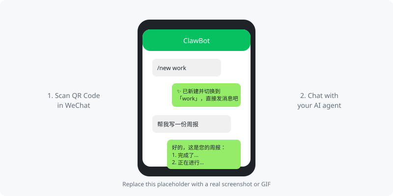

# dsh-clawbot

[](https://opensource.org/licenses/MIT)
[](https://github.com/tangwenhao616-netizen/dsh-clawbot/releases)
[](https://github.com/tangwenhao616-netizen/dsh-clawbot/issues)
[](https://github.com/tangwenhao616-netizen/dsh-clawbot)
[](https://github.com/deepseek-ai/deepseek-harness)

**English** | [中文](#中文)

---

> **Turn your WeChat into an AI agent command center.** Scan a QR code, chat with DeepSeek Harness directly from WeChat — no extra apps, no servers, no bridges.

<!-- TODO: Replace with a real screenshot or GIF. Recommended: 800px wide GIF showing QR scan → message → AI reply -->


## What is dsh-clawbot?

`dsh-clawbot` is a **WeChat channel plugin** for [DeepSeek Harness](https://github.com/deepseek-ai/deepseek-harness) (`dsh`). It connects your personal WeChat to a running `dsh` agent via Tencent's official ClawBot (iLink) protocol.

**The problem it solves:** You want to talk to your AI agent from your phone, but you don't want to deploy a public web UI, open ports, or install another app. With `dsh-clawbot`, you just scan a QR code in WeChat and start chatting — your agent runs locally, replies come back through WeChat.

### Why not the original `dsh-weixin`?

This is a **community-enhanced fork** of [`caoyilearnai/dsh-weixin`](https://github.com/caoyilearnai/dsh-weixin) `v0.2.1` with production-grade improvements:

| Pain Point | Original | dsh-clawbot |
|---|---|---|
| One message blocks everything | ❌ Single-threaded | ✅ Per-user queues, parallel turns |
| One user = one session | ❌ 1:1 mapping | ✅ Multiple named sessions per user |
| Switch models | ❌ Global only | ✅ Per-session model, live switch |
| Manage sessions | ❌ Delete state files | ✅ `/new` `/list` `/use` `/del` commands |
| Image handling | ⚠️ Poisons history | ✅ Vision-aware injection |

## Quick Start (5 minutes)

### Prerequisites

- [DeepSeek Harness](https://github.com/deepseek-ai/deepseek-harness) installed (`dsh` command available)
- WeChat ≥ 8.0.70 (iOS) with ClawBot enabled: **Settings → Plugins → ClawBot**

### 1. Install the plugin

```sh
dsh plugin --profile web add github:tangwenhao616-netizen/dsh-clawbot
```

### 2. Start dsh web

```sh
dsh web --port 3080
```

### 3. Scan the QR code

Open `http://127.0.0.1:3080/weixin` → click **"扫码登录"** → scan with WeChat.

### 4. Chat

Send any message to the bot in WeChat. Each WeChat user gets an independent Harness session.

```
You: /new work
Bot: ✨ 已新建并切换到「work」，直接发消息开始对话吧

You: 帮我写一份周报
Bot: [AI reply...]
```

## Features

- **Multi-session**: One WeChat user can own multiple independent sessions. Switch with `/2` or `#work 帮我写周报`
- **Slash commands**: `/new` `/list` `/use` `/model` `/rename` `/del` `/tag` `/help` — no web UI needed
- **Per-session model**: Each session remembers its own `provider/model`. Change with `/model 3`, live on next turn
- **Concurrency-safe**: Per-user inbound queues, per-message collectors — no cross-talk, no blocking
- **Rich media**: Text, voice (auto-transcribed by Tencent), images (vision-model aware injection)
- **Typing indicator**: Shows "正在输入…" while the agent thinks
- **Active push**: `ctx.weixin.push()` + `/weixin/send` HTTP endpoint + `push_weixin` tool for proactive messages
- **Secure by default**: Credentials stored with `0600` permissions, atomic writes, rate-limit backoff

## Documentation

- [Configuration](#configuration)
- [Slash Commands](#slash-commands)
- [Active Push](#active-push)
- [State Directory](#state-directory)
- [Security Notes](#security-notes)
- [Message Type Support](#message-type-support)

### Configuration

Override defaults in your profile's `cordis.patch.yml`:

```yaml
- insert:
    - id: weixin
      name: dsh-clawbot
      config:
        replyMode: last       # full | last
        maxChunk: 1200
        sendIntervalMs: 2000
```

| Key | Default | Description |
|---|---|---|
| `cwd` | `stateDir/workspace` | Working directory for new sessions |
| `stateDir` | `$DSH_HOME/dsh-weixin` | Credentials / session map / cursor directory |
| `replyMode` | `full` | `full` = whole turn text / `last` = final message only |
| `replyTimeoutMs` | `900000` | Single-turn reply timeout (ms) |
| `maxChunk` | `1500` | Max characters per WeChat message (auto-split) |
| `sendIntervalMs` | `2000` | Min interval between sends (iLink rate limit) |

### Slash Commands

| Command | Description |
|---|---|
| `/new [name]` | Create a new session and switch to it |
| `/list` | List all your sessions |
| `/2` | Quick switch to session #2 |
| `#name content` | Talk to a specific session directly |
| `/model` | List available models |
| `/model <n>` | Switch current session to model #n |
| `/rename <name>` | Rename current session |
| `/del <n>` | Delete session #n |
| `/tag on\|off` | Toggle session tag in replies |
| `/help` | Show help |

Chinese keywords also work: `列表` `帮助` `模型` `换模型`

### Active Push

**Cordis service** (other plugins):

```js
export const inject = ['weixin']
export function apply(ctx) {
  ctx.weixin.push('user@im.wechat', 'hello')
  ctx.weixin.sendAll('broadcast')
  ctx.weixin.status()
  ctx.weixin.sessions()
}
```

**HTTP route** (scripts / schedulers):

```sh
curl -X POST http://127.0.0.1:3080/weixin/send \
  -H 'content-type: application/json' \
  -d '{"to":"user@im.wechat","text":"hello"}'
# Broadcast: {"to":"all", "text":"..."}
```

**Agent tool**: `push_weixin` is registered automatically for scheduled tasks / alerts.

### State Directory

```
stateDir/
├── credentials.json    # bot_token / baseurl / ilink_bot_id / ilink_user_id / loggedInAt
├── session-map.json    # WeChat user → multi-session mapping (auto-migrated)
└── updates-buf.json    # getupdates long-poll cursor
```

### Security Notes

> ⚠️ The `/weixin` panel has **no authentication**. Only run `dsh web` on trusted networks.

- Bind to `127.0.0.1` or use a reverse proxy with auth if exposing remotely
- Credentials are stored with `0600` permissions and atomic writes
- Image injection is vision-model aware: if the current model doesn't support images, the image is skipped to avoid polluting history

### Message Type Support

| Type | Status |
|---|---|
| Text | ✅ Full support |
| Voice | ✅ Tencent server-side ASR → text injection |
| Image | ✅ CDN download → AES decrypt → attachment (vision-model aware) |
| File / Video / Others | ❌ Not supported (friendly fallback) |

## Contributing

We welcome contributions! Please see [CONTRIBUTING.md](CONTRIBUTING.md) for guidelines.

- Report bugs via [GitHub Issues](https://github.com/tangwenhao616-netizen/dsh-clawbot/issues)
- Submit PRs against the `main` branch
- Run tests before submitting: `pnpm test`

## License

[MIT](LICENSE) © dsh-clawbot contributors

---

## 中文

> **把你的微信变成 AI 代理指挥中心。** 扫码即用，在微信里直接和 DeepSeek Harness 对话——无需额外 App、无需公网服务器、无需桥接进程。

`dsh-clawbot` 是 [DeepSeek Harness](https://github.com/deepseek-ai/deepseek-harness) 的微信通道插件，基于腾讯官方 ClawBot（iLink）协议，把个人微信接入本地运行的 `dsh` 代理。

### 与原版 `dsh-weixin` 的区别

这是 [`caoyilearnai/dsh-weixin`](https://github.com/caoyilearnai/dsh-weixin) `v0.2.1` 的**社区增强版**，解决生产环境痛点：

| 痛点 | 原版 | dsh-clawbot |
|---|---|---|
| 一条消息阻塞全部 | ❌ 单线程 | ✅ 按用户排队，多会话并行 |
| 一个用户一个会话 | ❌ 1:1 映射 | ✅ 多命名会话 |
| 切换模型 | ❌ 只能全局 | ✅ 每会话独立模型，在线切换 |
| 管理会话 | ❌ 删状态文件 | ✅ `/new` `/list` `/use` `/del` 命令 |
| 图片处理 | ⚠️ 污染会话历史 | ✅ 视觉模型感知注入 |

### 快速开始（5 分钟）

**前提：**
- 已安装 [DeepSeek Harness](https://github.com/deepseek-ai/deepseek-harness)（`dsh` 命令可用）
- 微信 iOS ≥ 8.0.70，已开通 ClawBot：**设置 → 插件 → ClawBot**

**1. 安装插件**

```sh
dsh plugin --profile web add github:tangwenhao616-netizen/dsh-clawbot
```

**2. 启动 dsh web**

```sh
dsh web --port 3080
```

**3. 扫码登录**

打开 `http://127.0.0.1:3080/weixin` → 点「扫码登录」→ 微信扫码。

**4. 开始对话**

微信里给机器人发消息即可。每个微信用户自动对应独立会话。

```
你：/new 工作
机器人：✨ 已新建并切换到「工作」，直接发消息开始对话吧

你：帮我写一份周报
机器人：[AI 回复...]
```

### 功能特性

- **多会话**：一个微信用户可拥有多个独立会话，`/2` 或 `#工作 帮我写周报` 快速切换
- **斜杠命令**：`/new` `/list` `/use` `/model` `/rename` `/del` `/tag` `/help`，无需打开网页
- **每会话模型**：每个会话记忆自己的 `provider/model`，`/model 3` 切换，下一条生效
- **并发安全**：按用户入站排队，按消息 ID 收集回复，多用户多会话互不干扰
- **富媒体**：文字、语音（腾讯服务端转写）、图片（视觉模型感知注入）
- **打字指示**：AI 思考时显示「正在输入…」
- **主动推送**：`ctx.weixin.push()` + `/weixin/send` HTTP 路由 + `push_weixin` 工具
- **安全默认**：凭据 `0600` 权限存储，原子写入，限流指数退避

### 贡献

欢迎贡献！请阅读 [CONTRIBUTING.md](CONTRIBUTING.md)。

- 通过 [GitHub Issues](https://github.com/tangwenhao616-netizen/dsh-clawbot/issues) 报告 bug
- PR 请提交到 `main` 分支
- 提交前请运行测试：`pnpm test`

### License

[MIT](LICENSE) © dsh-clawbot contributors
